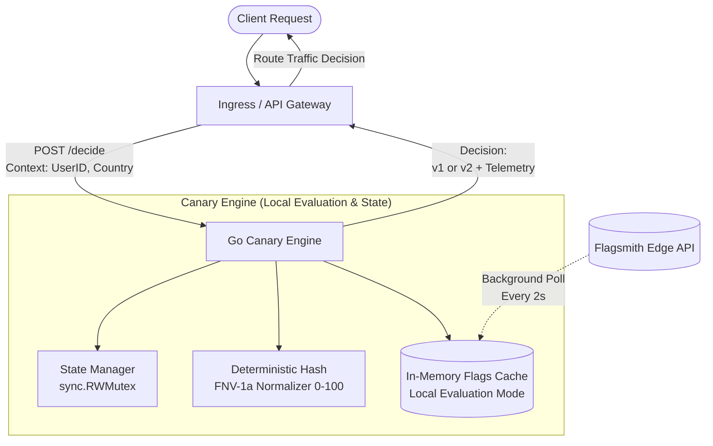

# 🚀 Canary Engine — Dynamic Routing & Feature Delivery Microservice

[](https://golang.org)
[](https://github.com/GoogleContainerTools/distroless)
[](https://k6.io)
[](LICENSE)

A high-throughput, low-latency **Dynamic Routing Engine** built in Go as a foundational service for an **Internal Developer Platform (IDP)**. 

It makes deterministic, real-time routing decisions (e.g., directing user segments between `v1` and `v2` canary releases) using **Flagsmith Feature Flags & Remote Config** with in-memory caching (**Local Evaluation mode**), sub-millisecond evaluation times, safe concurrency, and cloud-native lifecycle observability.

---

## 📑 Table of Contents

- [Architectural Overview](#-architectural-overview)
- [Platform & Engineering Highlights](#-platform--engineering-highlights)
- [Performance & Benchmark (k6)](#-performance--benchmark-k6)
- [API Specification](#-api-specification)
- [Engineering Patterns & Design Decisions](#-engineering-patterns--design-decisions)
- [Tech Stack](#-tech-stack)
- [Getting Started](#-getting-started)
- [Development & Automation](#-development--automation)

---

## 🏛 Architectural Overview

The engine acts as a dynamic decision layer for API gateways or ingress routers. Rather than forcing downstream services to handle complex rollout logic, services delegate routing logic to this engine.



---

## 💎 Platform & Engineering Highlights

This microservice was designed according to **Platform Engineering** best practices:

- **Local Evaluation Mode (Zero-Overhead Flag Evaluation):** Flags and remote configurations are fetched in background polling cycles (2s interval) and cached in-memory. Zero network round-trips occur during HTTP request evaluation.
- **Fail-Fast Initialization & Safe Fallback:** Strict validation on startup. If configuration sync fails at runtime, the engine safely falls back to conservative default routing rules without panicking or dropping traffic.
- **Thread-Safe State Management:** Concurrent access to internal readiness and hydration flags is governed via `sync.RWMutex`.
- **Cloud-Native Lifecycle Observability:**
  - `/healthz` (Liveness): Validates HTTP daemon health.
  - `/readyz` (Readiness): Validates whether in-memory caches are hydrated. Kubernetes will **not** route traffic to this pod until the flag cache is proven healthy.
- **Graceful Shutdown (`os/signal` + context timeout):** Listens for `SIGINT` / `SIGTERM`, drains in-flight HTTP requests within a 5-second deadline, stops background polling goroutines, and exits cleanly with code 0.
- **Distroless Multi-Stage Container:**
  - Build stage compiles a 100% static binary (`CGO_ENABLED=0`).
  - Runtime stage runs on `gcr.io/distroless/static-debian12:nonroot` as an unprivileged user (`nonroot:65532`).
  - Contains **no shell**, **no package manager**, and an ultra-minimal attack surface (~15MB final image).

---

## ⚡ Performance & Benchmark (k6)

Tested under high concurrency using [k6](https://k6.io) against a single containerized instance on local hardware:

| Metric | Result | Target SLO |
|---|---|---|
| **Throughput (RPS)** | **2,134 req/sec** | > 1,000 req/sec |
| **Median Latency (p50)** | **1.79 ms** | < 10 ms |
| **95th Percentile Latency (p95)** | **5.17 ms** | < 15 ms |
| **99th Percentile Latency (p99)** | **9.15 ms** | < 30 ms |
| **Error Rate (Failed Requests)** | **0.00%** (0 / 53,375) | < 1% |

```text
  █ THRESHOLDS 
    ✓ 'p(95)<15' p(95)=5.17ms
    ✓ 'p(99)<30' p(99)=9.15ms
    ✓ 'rate<0.01' rate=0.00%

  █ TOTAL RESULTS 
    http_reqs......................: 53,375 (2,134 req/s)
    http_req_duration..............: avg=2.23ms min=291µs med=1.79ms p(95)=5.17ms
    http_req_failed................: 0.00% (0 errors)
```

---

## 📡 API Specification

### 1. Evaluate Routing Decision

Evaluates dynamic canary rules against a user context.

- **Endpoint:** `POST /decide`
- **Headers:** `Content-Type: application/json`

**Request Body:**
```json
{
  "user_id": "usr_948123",
  "country": "BR",
  "app_version": "2.4.0"
}
```

**Response (HTTP 200):**
```json
{
  "target": "v2",
  "reason": "user bucket (23) within canary rollout (30%)",
  "telemetry": {
    "evaluated_at": "2026-09-08T12:31:08.989Z",
    "cache_hydrated": true
  }
}
```

### 2. Lifecycle Probes (Kubernetes / Orchestration)

| Endpoint | Method | Purpose | Healthy Status |
|---|---|---|---|
| `/healthz` | `GET` | **Liveness Probe:** confirms server event loop is active. | `200 OK` (`server is running`) |
| `/readyz` | `GET` | **Readiness Probe:** confirms flag cache is hydrated. | `200 OK` (`service is ready`) / `503 Service Unavailable` |

---

## 🧠 Engineering Patterns & Design Decisions

### 1. Dependency Inversion & Testability
To decouple business logic from third-party SDKs and environment state:
- **`flags.Reader` / `flags.Service` interfaces:** Abstracts the Flagsmith SDK. The routing engine only consumes abstract methods.
- **Injected Function Types:** Time evaluation (`time.Now`) and bucket calculations (`hash.NormalizedHash`) are injected as func signatures into the engine. This enables clean, deterministic unit tests without sleep statements or mock clock libraries.

### 2. Deterministic Hash Bucketing
Canary assignments must be **consistent** (the same user must always land on the same target version given identical configuration). 
We implement a normalized hashing function using `hash/fnv` (FNV-1a 32-bit), mapping string IDs uniformly onto a `0-100` percentage scale.

### 3. Comprehensive Testing Strategy
- **Table-Driven Tests:** Used extensively in `engine_test.go` and `hash_test.go` to test decision trees, boundary conditions, edge cases, and fallbacks.
- **Mock Locality:** Tests utilize mock structures placed close to consumption (`internal/testutil`), minimizing circular dependencies.

---

## 🛠 Tech Stack

- **Language:** Go 1.22+
- **HTTP Framework:** `gin-gonic/gin`
- **Feature Flags / Remote Config:** `Flagsmith SDK v4` (Local Evaluation)
- **Containerization:** Docker Multi-stage + Google Distroless (`gcr.io/distroless/static-debian12:nonroot`)
- **Benchmarking & Testing:** `k6`, `testify`, native Go `testing` toolchain

---

## 🚀 Getting Started

### Prerequisites
- [Go](https://golang.org/dl/) (1.22+)
- [Docker](https://www.docker.com/)
- Flagsmith Environment API Key (Server-Side)

### 1. Running Locally

```bash
# Clone the repository
git clone https://github.com/your-username/go-flagsmith.git
cd go-flagsmith

# Export your Flagsmith API Key
export FLAGSMITH_API_KEY="your-server-side-sdk-key"

# Run via Makefile (includes format, lint, and run)
make dev
```

### 2. Running with Docker (Distroless)

```bash
# Build the minimal multi-stage image via Makefile
make docker-build

# Run the container mapping port 8080 (verifies environment variables automatically)
make docker-run
```

---

## 🧰 Development & Automation

This project includes a fully configured developer workflow via `make`:

```bash
# Format and vet code
make fmt
make vet

# Run all unit tests
make test

# Generate HTML code coverage report (ignoring mocks and testutils)
make coverage

# Build and run the Distroless container
make docker-build
make docker-run

# Run the automated k6 performance and SLO validation suite
make load-test

# Clean up binaries and coverage artifacts
make clean
```
